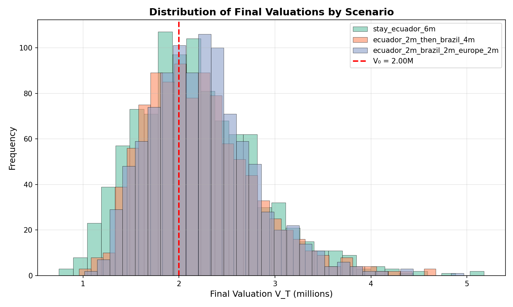

# Valuation Pathway Simulation Report

## Model

**Discrete-time regime-switching log-value dynamics:**

```
log V_{t+1} = log V_t + μ_{s_t} + σ_{s_t} * ε_t
```

where:
- `V_t` is the valuation at time t
- `s_t` is the regime at time t
- `μ_{s_t}` is the regime-specific monthly log-drift
- `σ_{s_t}` is the regime-specific monthly log-volatility
- `ε_t ~ N(0, 1)` is standard normal noise

## Simulation Parameters

- **Initial Valuation (V₀):** 2.00 million
- **Horizon:** 6 months
- **Simulations per scenario:** 1000

## Summary Statistics

| Scenario | Mean | P10 | P50 | P90 | Prob(V_T < V₀) |
|----------|------|-----|-----|-----|----------------|
| stay_ecuador_6m | 2.185 | 1.431 | 2.112 | 3.023 | 42.80% |
| ecuador_2m_then_brazil_4m | 2.218 | 1.553 | 2.131 | 2.966 | 41.10% |
| ecuador_2m_brazil_2m_europe_2m | 2.239 | 1.581 | 2.201 | 2.918 | 35.80% |

## Distribution of Final Valuations



---

*Generated by Valuation Pathway Simulator*